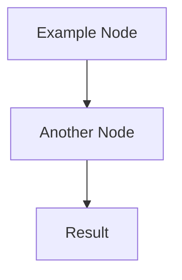

# Implementation Plan: [Feature Name]

> **IMPORTANT**: This plan must strictly follow the guidelines in `.snap/spec-kit/constitution.md` and ALL cursor rules in `.cursor/rules/*.mdc`.
>
> Implementation MUST adhere to these standards without exception.

---

## Tasks

1. [ ] [High-level task 1 - e.g., "Set up database schema and migrations"]
2. [ ] [High-level task 2 - e.g., "Implement authentication service with TDD"]
3. [ ] [High-level task 3 - e.g., "Create API endpoints and DTOs"]
4. [ ] [High-level task 4 - e.g., "Add integration tests"]
5. [ ] [High-level task 5 - e.g., "Update documentation"]

_Break down the feature into 5-10 high-level tasks. Each task should be substantial enough to represent meaningful progress. Each task is numbered for easy reference during implementation._

---

## Technical Notes

### Architecture Approach

[Describe the overall technical approach and architecture decisions. Include:]
- How this feature fits into the existing system
- Key architectural patterns being used (e.g., repository pattern, CQRS, etc.)
- Major components and their responsibilities
- Data flow and interactions between components

### Integration Points

[List and describe integrations with other parts of the system:]
- Which existing modules/services does this interact with?
- What APIs or interfaces are being consumed or provided?
- Any external dependencies (databases, third-party services, etc.)

### Technical Decisions

[Document important technical decisions and their rationale:]
- Technology choices (if any new libraries/tools are needed)
- Design patterns and why they were selected
- Trade-offs considered and decisions made
- Performance or security considerations

### Data Model

[If applicable, describe the data model:]
- New entities or changes to existing entities
- Relationships between entities
- Key fields and their purposes
- Validation rules

### Mermaid Diagrams

[Include mermaid diagrams here if needed to visualize architecture, flows, or data models]

_Remove this section if no diagrams are needed._

---

## Implementation Status

- **Status**: Not Started
- **Started**: [Date when implementation begins]
- **Completed**: [Date when implementation is finished]
- **Verified**: [Date when verification passes - added by /snap/verify]
- **Last Updated**: [Date of last status update]

**Status Values:**
- `Not Started` - Implementation has not begun
- `In Progress` - Currently implementing (/snap/implement running)
- `Needs Verification ⚠️` - Implementation done, awaiting verification
- `Completed ✅` - All checks passed, ready for deployment

---

## Implementation Progress

_This section is automatically updated during `/snap/implement` to track checkpoint completion._

### Task 1: [Task Name from Tasks section]
- **Status**: ⏸️ Pending
- **Started**:
- **Completed**:
- **Tests Added**:
- **Files Created/Modified**:
- **Verification Notes**:

### Task 2: [Task Name from Tasks section]
- **Status**: ⏸️ Pending
- **Started**:
- **Completed**:
- **Tests Added**:
- **Files Created/Modified**:
- **Verification Notes**:

### Task 3: [Task Name from Tasks section]
- **Status**: ⏸️ Pending
- **Started**:
- **Completed**:
- **Tests Added**:
- **Files Created/Modified**:
- **Verification Notes**:

_Add more tasks matching the number of tasks from the Tasks section. Each task represents completion with full verification._

**Status Legend:**
- ⏸️ Pending - Not started yet
- 🔄 In Progress - Currently being implemented
- ✅ Completed - Fully implemented and verified

---

### Implementation Notes

[Use this space to track:]
- Blockers or challenges encountered
- Deviations from original plan (with justification)
- Important decisions made during implementation
- Items that need follow-up or refactoring
